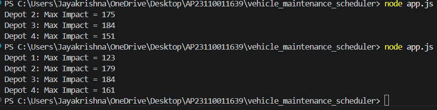

# 🚀 Vehicle Maintenance Scheduler & Notification System

## 📌 Overview
This project is part of a backend evaluation and includes:
- Logging middleware integrated with external APIs  
- Vehicle maintenance scheduler using an optimization algorithm  
- Notification system design covering multiple backend stages  

---

## 📁 Project Structure

Project Structure:
AP23110011639/
├── logging_middleware/
│   └── logger.js
├── vehicle_maintenance_scheduler/
│   └── app.js
├── screenshots/
│   └── scheduler_output.png
├── notification_system_design.md
├── package.json
└── .gitignore

---

## ⚙️ Features

### 🔹 Logging Middleware
- Centralized logging using external API  
- Used across all modules  
- Supports multiple log levels (info, error)  

### 🔹 Vehicle Maintenance Scheduler
- Fetches depots and vehicles from APIs  
- Uses **Knapsack algorithm** for optimization  
- Maximizes impact within available mechanic hours  
- Integrated logging for all operations  

### 🔹 Notification System Design
- Covers **Stage 1 to Stage 6**  
- Includes:
  - API Design  
  - Database Design  
  - Query Optimization  
  - Performance Improvements  
  - Scalable Architecture  

---

## 🛠️ Technologies Used
- Node.js  
- Axios  
- REST APIs  

## ▶️ How to Run

1. Install dependencies:
npm install

2. Run the scheduler:

node vehicle_maintenance_scheduler/app.js

---

## 📊 Sample Output
Depot 1: Max Impact = 123
Depot 2: Max Impact = 179
Depot 3: Max Impact = 184
Depot 4: Max Impact = 161

---

## 📸 Output Screenshot

---

## ⚠️ Notes
- Logging middleware is used throughout the application  
- API authentication is handled using Bearer token  
- Token may expire — regenerate if needed  

---

## 👤 Author
**Roll Number:** AP23110011639